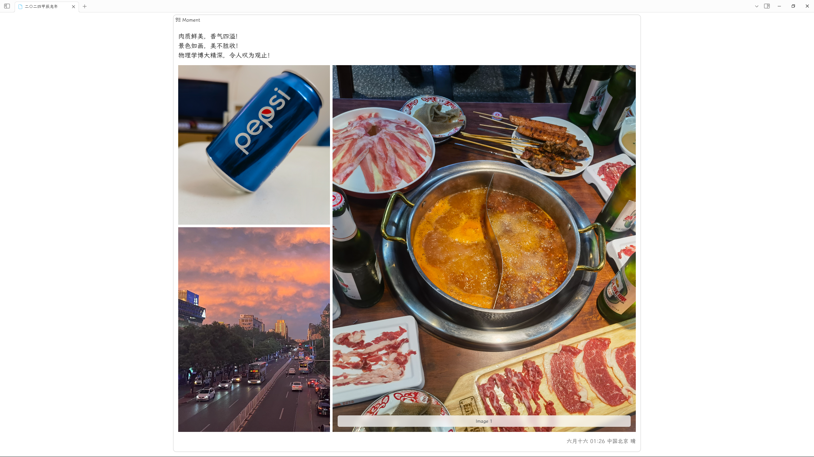

# Obsidian Moment Plugin

这是一个用来记录生活瞬间的插件。

## TODO
1. [x] 使用中国农历记录时间，使用节气进行分类
2. [x] 加以简单的css样式实现简单的动态样式。
3. [x] 使用高德开放平台获取城市、天气；支持默认城市、天气。
4. [ ] 更丰富的样式、设置、功能持续开发中

欢迎大家试用，提问题。
## 效果图

## 捐赠/联系
### 微信

### 捐赠

